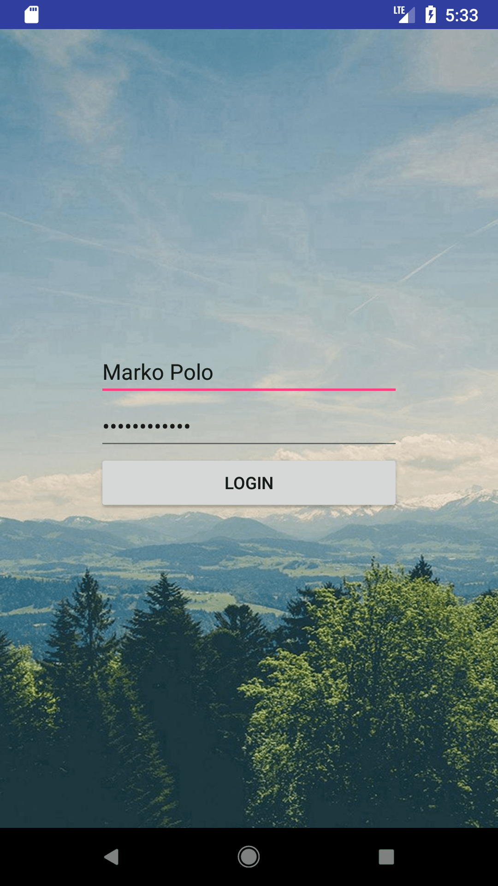
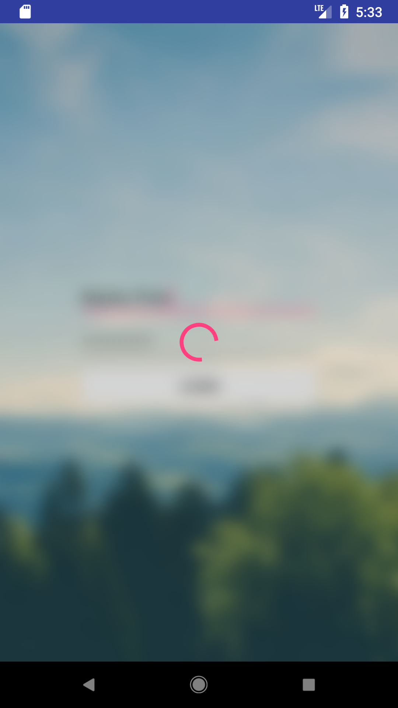
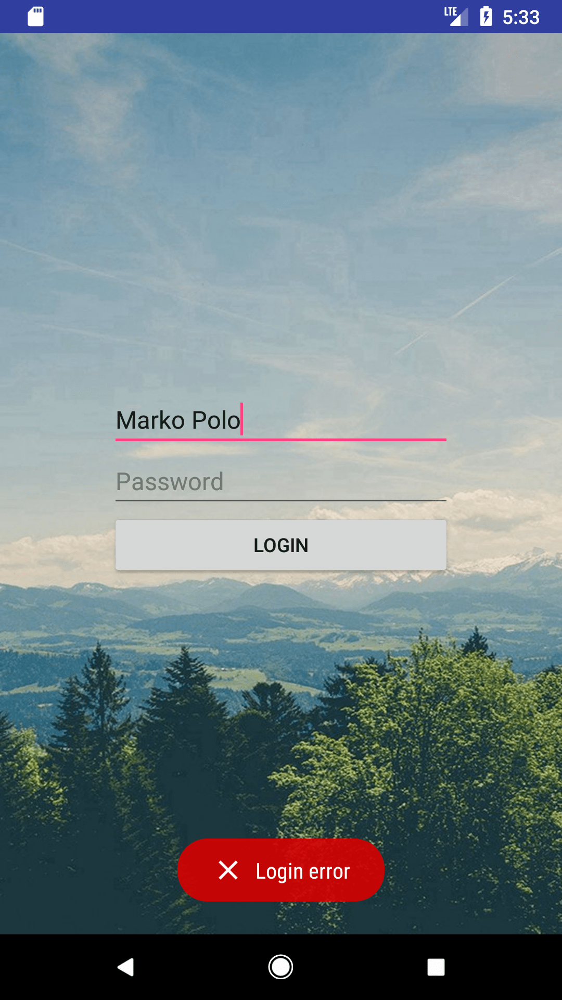
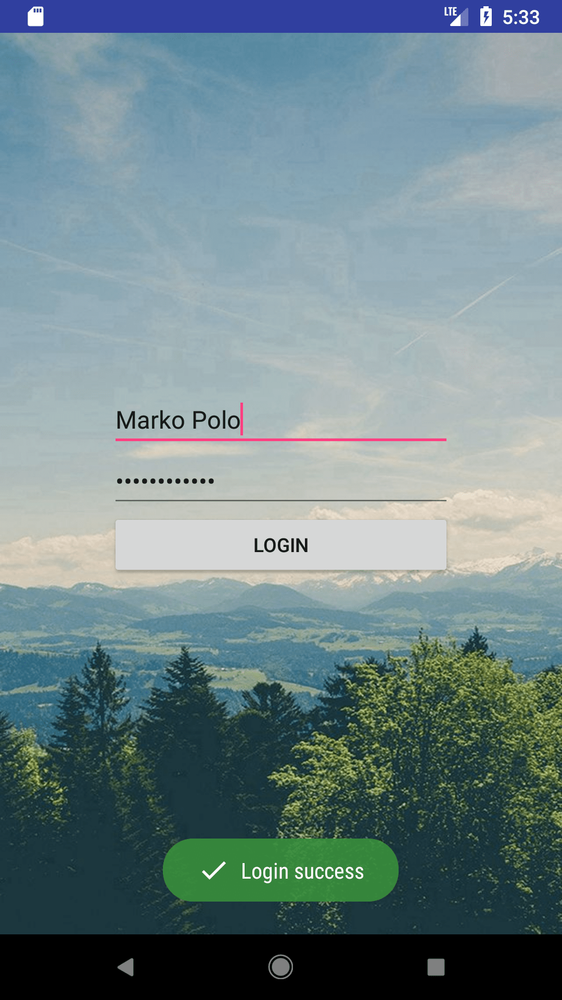

# Android MVP comparison

In the world of Android there're a lot of different MVP frameworks and libraries.  
This repo is aimed to help you to choose the right one by __looking at code__.

What do we expect from a perfect MVP library? Here're the most common __requirements__:
- It must handle screen rotations by itself
- It must be easy to setup with a DI library (especially Dagger)
- It must have a flexible API

So... to cut it short:

| Library | Support screen rotations | Dagger friendly | Easy to customize |
| :-----: | :----------------------: | :-------------: | :---------------: |
| EasyMvp | no                       | yes             | yes               |
| Moxy    | yes                      | somewhat        | yes               |

## Application

Application consists of a single login screen:

|    |  |
| :---------------------: | :-------------------------: |
|  |  |

## Libraries

Every branch represents a single library

>TODO: Mosby

>TODO: Moxy

>TODO: EasyMvp

>TODO: Other..

## License

	Copyright 2018 NikolayKul

	Licensed under the Apache License, Version 2.0 (the "License");
	you may not use this file except in compliance with the License.
	You may obtain a copy of the License at

	  http://www.apache.org/licenses/LICENSE-2.0

	Unless required by applicable law or agreed to in writing, software
	distributed under the License is distributed on an "AS IS" BASIS,
	WITHOUT WARRANTIES OR CONDITIONS OF ANY KIND, either express or implied.
	See the License for the specific language governing permissions and
	limitations under the License.
